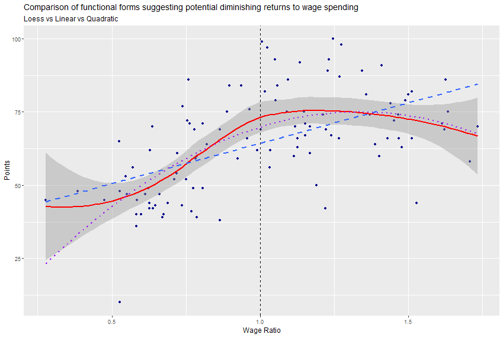

# The Survival Formula: Predictors of EPL Consistency

*Soccernomics* famously argues that a club's wage bill is the single best predictor of its league position. However, this project challenges that consensus by analyzing the **"Non-Relegated 9"**—the specific cohort of teams that have avoided relegation for 10 consecutive seasons (2014–2024).

**Research Question:** "For Premier League clubs with long-term survival status, is **Wage Expenditure** truly the dominant predictor of success, or do **Managerial Stability** and **Squad Experience** play a more significant statistical role?"

By isolating this unique group, this study uses regression analysis to determine the **most important predictor** of points accumulation among three competing variables:
1.  **Financial Power** (Wage Bill)
2.  **Managerial Stability** (Tenure Duration)
3.  **Squad "Game Intelligence** (Relative Experience Index)

## Scope
I will be collecting the following data points: Club, Season, Total Wage Bill, League Position, Manager Tenure(In Days), Matches Played and Points.
Additional Data Points: Squad Age, GD, XG, Wage Spent Per Position.

### Teams
- Arsenal
- Everton
- Liverpool
- Manchester United
- Tottenham
- Chelsea
- Manchester City
- Crystal Palace
- West Ham

## Methodology
### 1. Manager Tenure(Stability):
To strictly measure "Ex Ante" stability (stability prior to performance), manager tenure is calculated using a **September 2nd Snapshot Rule**:

-**Definition:** Tenure is defined as the consecutive days a manager has held the position as of September 2nd of the target season.

-**Rationale:** This date aligns with the closure of the English Premier League Transfer Window. It effectively attributes the squad's construction and pre-season preparation to the manager in charge at that deadline.

-**Noise Reduction:** This method isolates "Preparation Stability" from "Survival Tenure," preventing reverse causality where match results influence the tenure variable (e.g., mid-season sackings).

### 2.The Relative Experience Index (REI)
Rather than using average age, which fails to capture game intelligence, I engineered a **Relative Experience Index**.

-**Metric:** Cumulative career appearances in Europe's "Top 5 Leagues" (EPL, La Liga, Bundesliga, Serie A, Ligue 1) for all players with >5 apps in the season.

-**Normalization:** Raw experience counts were normalized against the 9-team cohort average for each specific season.
    * *Formula:* `Team_Avg_Experience / Cohort_Avg_Experience

- **Why Normalize?** This controls for the secular trend of increasing career lengths over the seasons, ensuring that a "highly experienced" team in 2014 is comparable to one in 2024.

### 3. Data Integrity & Constraints

-**Leap Year Adjustment:** The algorithms account for the extra calendar day in 2016, 2020, and 2024 to ensure precise tenure calculations.

-**The "Unified Season" Approach:** January transfers are included to reflect managerial adaptability/correction, with their experience metrics retroactively baselined to the season start to maintain temporal consistency.

## Project Roadmap
- [X] **Phase 1: Scope Definition & Team Selection**
- [X] **Phase 2: Data Collection**(Web Scraping Wages & Match Stats via Selenium/Soccerdata API)
- [X] **Phase 3: Feature Engineering**
   - [X] Calculate Manager Tenure (Sept 2nd Rule)
   - [X] Calculate Relative Experience Index (Top 5 Leagues)
- [X] **Phase 4: Exploratory Data Analysis (EDA)** (Correlation Matrices & Visualizations)
- [X] **Phase 5: Regression Modeling** (OLS / Panel Data Analysis)
- [X] **Phase 6: Final Report**

## Key Findings
- Structure > Strategy: "Club Identity" (Fixed Effects) is the primary driver of points ($p < .001$). For example, Manchester City starts with a +13 point structural advantage over the baseline, holding all else constant.
- Money Has Limits: Once club structure is controlled for, marginal increases in wage spending (Log_Wage) do not statistically predict higher point totals ($p = 0.38$).
- The Myth of Stability: Managerial tenure has no significant linear or quadratic relationship with performance, disproving the "stability dividend" hypothesis for this cohort.

## Technical Implementation
- Languages: R, Python
- Libraries: tidyverse, ggplot2, car,e1071,ggcorplot
- Statistical Methods:
   - Fixed Effects Modeling: To control for unobserved club heterogeneity.
   - Nested F-Tests (ANOVA): Used to scientifically reject complex quadratic/interaction models in favor of Parsimony.
   - Multicollinearity correction: Applied Mean Centering to resolve structural multicollinearity (VIF reduced from >50 to <5).
 
## Visualizations
- Functional Form Analysis (Wages vs. Points) Testing for diminishing returns using Loess, Linear, and Quadratic fits

